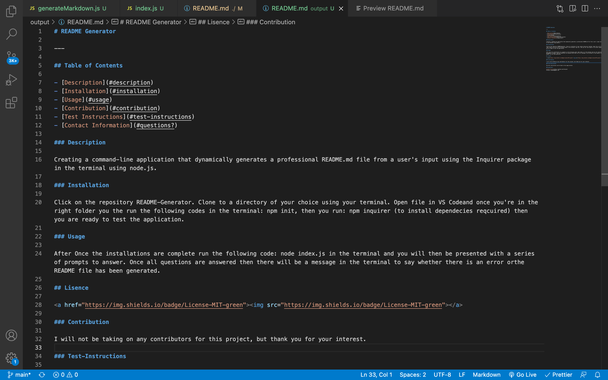
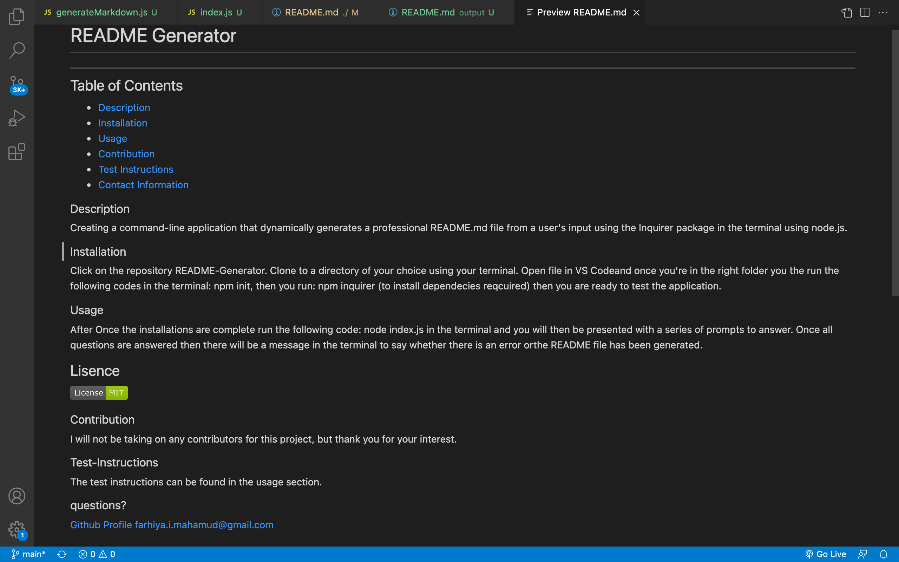
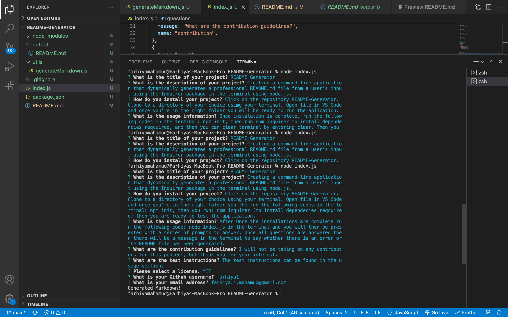

# README Generator

# Why did I build this project?

To create a command-line application that dynamically generates a professional README.md file from a user's input using the Inquirer package in the terminal using node.js. To also build on my javascript skills in a different enviroment.

# So far I have achieved?

1. To generate a read me file through a series of prompts that is to be answered in the terminal.

# What I intend to add in the near future?

1. To continue to build on it with the skills I continue to gain. Ask different questions. Altering structure for different idustries. Use this to eveen generate a readme for my own projects.

## User Story

```md
AS A developer
I WANT a README generator
SO THAT I can quickly create a professional README for a new project
```

## Acceptance Criteria Set To Achieve This

```md
GIVEN a command-line application that accepts user input
WHEN I am prompted for information about my application repository
THEN a high-quality, professional README.md is generated with the title of my project and sections entitled Description, Table of Contents, Installation, Usage, License, Contributing, Tests, and Questions

WHEN I enter my project title
THEN this is displayed as the title of the README

WHEN I enter a description, installation instructions, usage information, contribution guidelines, and test instructions
THEN this information is added to the sections of the README entitled Description, Installation, Usage, Contributing, and Tests

WHEN I choose a license for my application from a list of options
THEN a badge for that license is added near the top of the README and a notice is added to the section of the README entitled License that explains which license the application is covered under

WHEN I enter my GitHub username
THEN this is added to the section of the README entitled Questions, with a link to my GitHub profile

WHEN I enter my email address
THEN this is added to the section of the README entitled Questions, with instructions on how to reach me with additional questions

WHEN I click on the links in the Table of Contents
THEN I am taken to the corresponding section of the README
```

# To access this project the following links are provided:

To access Github Repository

1. https://github.com/Farhiya1/README-Generator.git

To access Application deployed at live URL

2.  https://farhiya1.github.io/README-Generator/

To access Application Demo via Link.

3. https://drive.google.com/drive/folders/1Mj58nMhuy7lOxCNZxN42mHNAmbSNIH05?usp=sharing

# Screenshot of deployed application)

1. Screenshot displaying Generated README.md File



2. Screenshot displaying Generated README.md File Preview



3. Screenshot of terminal with Prompts


